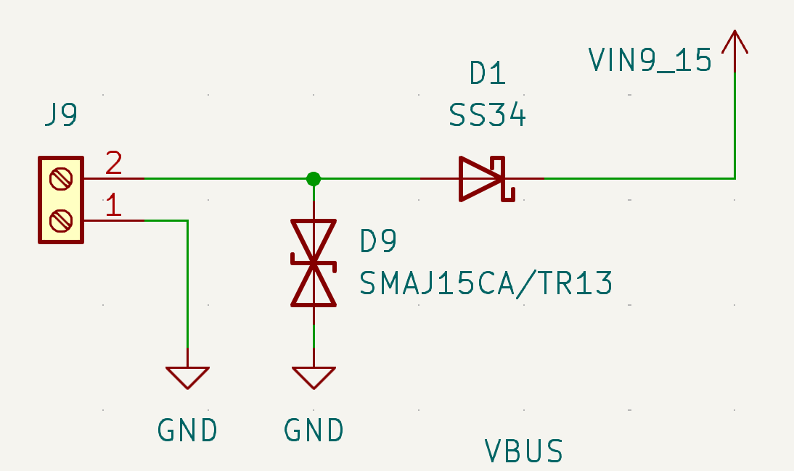
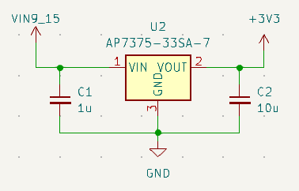

(F1) Power
==========

Functional description
----------------------

The power sub-circuit is in charge of reverse-polarity protection and ESD protection on the 9-15V input terminal block using a TVS and a Schottky diode.

The power sub-circuit integrates a 9-15V to 3.3V linear voltage regulator to power the UART sub-circuit up to 300mA.

Design constraints
------------------

N/A

Circuit diagram
---------------

Design calculations
-------------------

N/A

Simulation results
------------------

N/A

Power integrity
---------------

N/A
