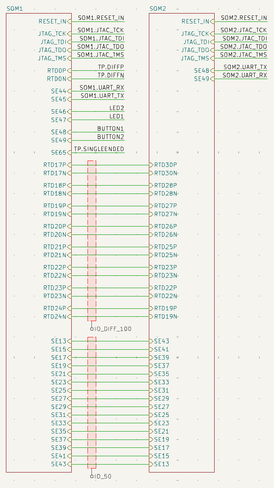

(F2) SOMs
=========

Functional description
----------------------

The SOM sub-circuit integrates two DDR4-SODIMM connectors to integrate two ECAP5-BSOM modules.

.. note:: Refer to the circuit diagram for pinout information.

Design constraints
------------------

N/A

Circuit diagram
---------------

Design calculations
-------------------

N/A

Simulation results
------------------

N/A

Power integrity
---------------

N/A
