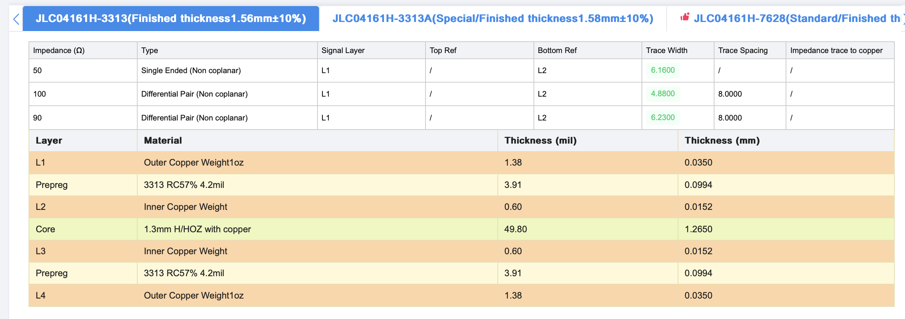

Routing
=======

Stackup
-------

The stackup used is JLCPCB's JLC08121H-3313 1.2mm pcb stackup.

.. flat-table:: Layer allocation
   :header-rows: 1
   :width: 100%

   * - Layer
     - Allocation

   * - Top layer L1
     - High-Speed signals

   * - Inner Layer L2
     - GND

   * - Inner Layer L3
     - Power/GND

   * - Bottom layer L4
     - High-Speed signals

Trace impedance
---------------

.. flat-table:: Net classes
   :header-rows: 1
   :width: 100%

   * - Impedance
     - Layer
     - Trace width
     - Differencial-pair spacing

   * - Single-ended 50ohms
     - L1/L4
     - 6.16mil (0,156464mm)
     - N/A

   * - Differencial 100ohm
     - L1/L4
     - 4.88mil (0,123952mm)
     - 8.0mil (0,2032mm)

